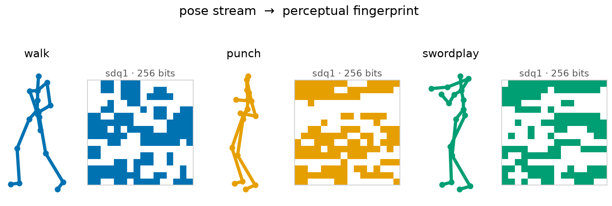
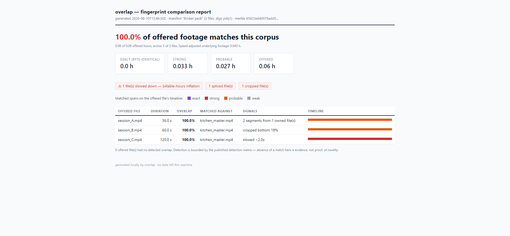

# OverlapPose

<p align="center"></p>

**A fork of [World-Archive/overlap](https://github.com/World-Archive/overlap) that extends
its perceptual fingerprinting to proprioceptive data: pose trajectories, joint/IMU
channels, and motion streams stored as Parquet.** Everything the original does for
video, MCAP and ROS bags is unchanged and still works; this fork adds a second
modality beside it.

## What changed from the original

The original hashes decoded video frames with a PDQ-style image hash (`pdq2`).
What makes that hash robust is not anything image-specific - it is the recipe:
normalize, project onto a small low-frequency basis, threshold every coefficient
at the median, compare by Hamming distance. OverlapPose applies the same recipe
directly to signal data with a new kernel, `sdq1`:

- **A Parquet reader** picks up files shaped one-row-per-sample with a time
  column (`time_ms`/`time_us`) and dense numeric channels - the common export
  shape for mocap landmarks, joint states and IMU logs. Sparse side-channels
  (mostly-NaN columns, e.g. 5 Hz UWB fixes inside a 1 kHz log) are excluded
  automatically; text label columns are metadata, not evidence, and are ignored.
- **The `sdq1` kernel** takes 2-second windows of all channels on the same fixed
  time grid the video path samples frames on, resamples each window to a fixed
  length (so the hash is independent of the native sample rate), and binarizes
  a 32 x 8 slab of **Fourier band energies** - DCT structure across channels,
  log power in eight low-frequency bands along time - against each band's
  median: 256 bits per window, 32 bytes, the same shape as an image hash.
  Band *energies* rather than signed spectral coefficients is the load-bearing
  choice: signed bits measure phase, and a copy whose windows are misaligned
  by a fraction of a second (any off-grid trim) falls to the unrelated floor -
  measured, at a 28 ms shift. Energies shift only mildly under misalignment
  and are exactly invariant to time reversal. Per-channel robust scaling
  (floored so locked mocap channels cannot amplify noise) makes the hash
  invariant to unit changes and calibration offsets by construction.
- **The matcher is nearly untouched.** Segment chaining, trim/splice/speed
  localization and the report pipeline only ever see 32-byte codes on a time
  grid, so they work on signal data as-is. The one signal-specific change:
  the Hough slope ladder is bounded to plausible resale manipulation
  (0.4x-2.5x), because repeated takes of the same scripted action are
  legitimately window-similar and would otherwise chain into absurd steep
  diagonals.
- Image and signal hashes carry separate identities (`pdq2`/`sdq1`); one index
  can hold both, manifests declare which one they carry, and a mismatch is
  refused rather than guessed at - same policy as upstream.

## Using it

```
pip install 'overlap-cli[pose]'      # adds pyarrow; from this fork's checkout: uv sync

overlap index /data/mocap            # .parquet files are picked up next to videos
overlap export -o offer.ovlm         # pose-only manifests declare sdq1 in the header
overlap compare offer.ovlm           # same flow, same report, same exit codes
```

There is nothing pose-specific to configure: the reader recognizes time-series
Parquet by its schema, one file becomes one `proprio` stream, and the usual
vendor/lab workflow (index, self-dedupe, export, compare, verify) applies.

## Measured confidence and data rate

Numbers are measured on two real datasets - a 132-channel 1 kHz simulated
ICM-42688 IMU stream, and 90 Hz optical mocap from
[HiPHI](https://huggingface.co/datasets/noitomrobotics/HiPHI) (55-joint BVH,
330 channels) - and reproduce with
[`benchmarks/bench_sdq_noise.py`](benchmarks/bench_sdq_noise.py). Unrelated
windows disagree by **~123 +/- 11 of 256 bits** - the binomial floor - so the
matching radius of 56 bits sits ~6 sigma below it, and the matcher
additionally requires ~10 s of consecutive agreeing windows on one consistent
diagonal before it reports anything.

Gaussian noise added to the raw samples, sigma as a fraction of each channel's
signal spread (mean bit flips of 256, same window). Noise margins depend on
the native rate, because only the in-band fraction of white noise lands in
the band slab - both rows are honest numbers, not tuning artifacts:

| noise sigma | 1% | 5% | 10% | 20% | 50% | 100% |
|---|---|---|---|---|---|---|
| IMU @ 1 kHz | 1.1 | 4.8 | 9.0 | 16.3 | 35.5 | 56.1 |
| mocap @ 90 Hz | 6.6 | 26.0 | 43.0 | 63.7 | 90.4 | 107.0 |

Robustness to grid misalignment and small manipulations (mean bits, both
datasets agree within a few bits): a 125 ms off-grid shift costs ~25, a 2%
resample ~16, time reversal of the window ~0 (invariant by construction).
For scale, 5% of signal spread is already ~30x the sensor noise floor of a
kHz MEMS IMU; at 1 kHz there is no noise level that defeats the hash and
leaves the data sellable.

**Validated end-to-end on HiPHI** (13 real motions indexed as the corpus; a
hostile 7-file offer compared against it through the real CLI):

| offer file (real manipulation) | result |
|---|---|
| 15.1 s *off-grid* trim, clean | **98% owned**, trim localized, speed 1.00 |
| 15.1 s trim + 5% Gaussian noise | **97% owned**, conf 0.99 |
| 15.1 s trim + 10% Gaussian noise | **84% owned**, conf 0.94 |
| resampled to 1.02x speed | **90% owned, speed 0.98 measured**, strong |
| different take of the same scripted action | 0% - correctly no match |
| HiPHI's own left/right `__mirror` variant | 0% - documented limit |
| whole stream played backwards | 0% - documented limit |

Data rate: fingerprints cost about **0.9 MB per hour** in the local index and
about **130 KB per hour** in an exported manifest (4 windows/s indexed, ~1/s
exported - the same 32-byte codes and manifest format as upstream). Indexing
~14 minutes of 330-channel mocap takes seconds.

**Honest limits, measured:** deep speed changes are not detected - windows
survive ~10% resampling (30 bits) but the classic 0.5x billable-hours
slowdown lands at the floor; the fix is the signal analog of the image crop
ladder (indexing each window at a few resample rates). Whole-stream
*reversals* produce exact window matches but along a slope of -1, which the
temporal matcher does not fit yet. Left/right *mirrored* motion is a
rig-specific channel permutation the generic reader cannot know, so mirror
variants do not match - HiPHI ships mirror pairs, which is how this row is
asserted. At mocap rates (90 Hz) noise margins are intrinsically thinner
than at 1 kHz (see table). Aligned text labels are carried nowhere: labels
are cheap to edit, the signal is the evidence.

Everything below is the original README; all of it still applies to the video
side, unchanged.

---

# overlap

**Perceptual fingerprinting and overlap detection for robotics datasets. Local-only.**

[](LICENSE)
[](pyproject.toml)

## The problem

Robotics labs buy egocentric and teleoperation datasets largely sight-unseen:
the footage is the product, so vendors can't share it before the sale, and
buyers can't check what they're getting before paying. That gap gets
exploited. Off-the-shelf datasets are resold to multiple buyers with the
files re-encoded, trimmed, spliced, mirrored, or - a known trick for
inflating billable hours - **slowed down**, so that plain checksum
comparison sees "new" data. A lab can end up paying twice for footage it
already owns and only find out after delivery, if at all.

overlap closes that gap without anyone sharing raw data:

1. **The vendor** fingerprints their dataset locally and exports a compact
   manifest (`.ovlm`) - perceptual fingerprints and file metadata, never
   frames or pixels. Roughly 120 KB per hour of footage.
2. **The lab** keeps a local fingerprint index of everything it already owns
   and compares the incoming manifest against it - entirely offline.
3. The report answers the purchasing question directly: *"62% of these hours
   match footage we already own - here are the files, the matched segments,
   and three files that were slowed to double their runtime."* Buy the other
   38%.

Both sides run the same open tool, so neither has to trust the other's
tooling - and honest vendors benefit most: `overlap self-dedupe` proves a
quote contains no internal duplicates, and `overlap verify` lets the buyer
confirm the delivery matches the quoted manifest bit-for-bit.

## How it works

```
videos / MCAP / ROS bags ──► decoded frames ──► perceptual hashes (pdq2)
                                                      │
                              local index (SQLite + shards)  ◄── lab corpus
                                                      │
vendor manifest (.ovlm, no pixels) ──► compare ──► report (JSON / HTML)
```

Fingerprints are computed on **decoded pixels, never on file bytes** - so
re-encoding, container swaps, metadata stripping, and re-wrapping an MCAP
camera topic as an `.mp4` all collapse to the same fingerprints.

Matching happens at the *segment* level: shared footage forms straight lines
in the (query-time × corpus-time) plane, and the line's slope directly
measures speed changes - a file slowed to 0.5x shows up as a slope-2 line,
flagged as billable-hours inflation with the underlying real footage hours
quantified. Splices appear as multiple line segments from different sources;
trims as partial segments.

Files assembled out of pieces are reported as such: each matched stretch is
its own segment, so an offer built from two cuts of one master reads as *"2
segments from 1 owned file"*, and an offer that pads owned footage with new
material reports only the owned share.

Manipulations that change the *frame itself* are handled by indexing the
corpus in several variants, so the buyer never has to guess what was done:
each frame is stored mirrored as well as upright (flips), re-hashed at a
ladder of centered crops (zoom-crops to ~30%), and - when enabled - at
one-sided edge crops (`--crop-edges bottom,top`) for copies that trim an
overlay strip away. A match reports which variant it landed on - *"cropped
bottom 18%, mirrored"* - so the report describes the manipulation, not just
the overlap.

Evidence that falls below the reporting threshold is listed separately rather
than dropped: a 0% headline never hides a partial match.

## Quickstart

Install (Python ≥ 3.10; [ffmpeg not required](#install) for normal use):

```
pipx install overlap-cli        # command is `overlap`
```

**You're a vendor** - fingerprint inventory, prove freshness, export a manifest:

```
overlap index D:\datasets\teleop-2026q3
overlap self-dedupe                       # find internal duplicates before quoting
overlap export -o q3-offer.ovlm --label "Q3 kitchen teleop" --anonymize-paths
# send q3-offer.ovlm to the buyer (it contains fingerprints, not footage)
```

**You're a lab** - index what you own once, then screen every offer:

```
overlap index /data/corpus                # resumable; run it after every purchase
overlap compare q3-offer.ovlm -o report.json --html report.html
# report.html: overlap %, matched segments, slowdown/splice/flip flags
```

Gate a procurement pipeline on it (exit code 3 = overlap at/above threshold):

```
overlap compare q3-offer.ovlm --fail-over 20 && echo "clean enough to buy"
```

After delivery, verify the bytes match what was quoted:

```
overlap verify q3-offer.ovlm --data /data/incoming/delivery
```

## The buying methodology

The commands map onto a purchasing decision: keep fingerprints of everything
you have seen, ask for a manifest covering the whole offer, check it against
the sample you were shown, ask how much you already own, and ask whether two
sellers are selling the same thing. Step by step, with the commands and what
each step can and cannot establish: [docs/buying-workflow.md](docs/buying-workflow.md).

## What it detects - and what it does not

overlap's detection claims are governed by a matrix that is **literally
executable**: the table below is generated from the same file the test suite
runs, and a test fails if they drift apart.

<!-- detection-matrix:start (generated by scripts/gen_detection_matrix_doc.py) -->
| manipulation | example tested | status | test row |
|---|---|---|---|
| metadata strip / rename | Byte-identical file with a different name and stripped metadata | **designed to detect** | `identical-rename` |
| re-encode | Transcode to H.265 at visibly lower quality | **designed to detect** | `reencode-h265-crf30` |
| container swap | Repackaged mp4 -> mkv without re-encoding | **designed to detect** | `container-swap-mkv` |
| trimming | A 12-second cut from the middle of a corpus file | **designed to detect** | `trim-12s` |
| trimming | A cut at an arbitrary sub-second point (sampling grids misaligned) | **designed to detect** | `trim-arbitrary-phase` |
| splicing | 15 s of corpus footage spliced with unrelated footage | **designed to detect** | `splice-15s-plus-other` |
| reassembly (one master) | Two non-adjacent pieces of one master concatenated and sold as a new session | **designed to detect** | `merge-two-same` |
| concatenation (two owned files) | Pieces of two different owned masters concatenated into one offer | **designed to detect** | `merge-two-masters` |
| concatenation (owned + new) | Owned footage concatenated with genuinely new footage; only the owned half should count | **designed to detect** | `merge-owned-plus-new` |
| speed change (slowdown) | Slowed to half speed - the billable-hours inflation trick | **designed to detect** | `speed-0.5x` |
| speed change (speedup) | Sped up to double speed | **designed to detect** | `speed-2x` |
| horizontal flip | Mirrored left-right | **designed to detect** | `hflip` |
| crop (slight) | Center crop keeping 95% of each dimension, upscaled back | **designed to detect** | `crop-5pct` |
| crop (moderate) | Center crop keeping 85%; needs --preset balanced | **designed to detect** | `crop-15pct` |
| crop (heavy) | Center crop keeping 70%; needs --preset balanced | **designed to detect** | `crop-30pct` |
| crop (beyond the ladder) | Center crop keeping 60% - past the deepest rung of the deepest ladder | not detected | `crop-40pct` |
| edge crop (bottom strip) | Bottom 15% removed (overlay strip trimmed); needs --crop-edges bottom | **designed to detect** | `crop-bottom-15` |
| edge crop (top strip) | Top 10% removed; lands between the 6% and 12% rungs | **designed to detect** | `crop-top-10` |
| edge crop (thin bottom bar) | Bottom 8% removed - a trimmed HUD strip, caught by the default bottom rung | **designed to detect** | `crop-bottom-8-default` |
| crop (slight zoom) | Center crop keeping 92% - caught by the default centred rung | **designed to detect** | `crop-centre-8-default` |
| edge crop, variants disabled | Bottom 15% removed - deeper than the default bottom rung reaches | not detected | `crop-bottom-default-config` |
| letterbox / aspect change | 15% black bars top and bottom | **designed to detect** | `letterbox-15pct` |
| watermark / overlay | Corner text overlay at 60% opacity | **designed to detect** | `watermark-corner` |
| color grading | Saturation +40%, gamma 1.15, brightness and contrast shifts | **designed to detect** | `colorgrade` |
| frame-rate resample | Resampled from 24 fps to 15 fps | **designed to detect** | `fps-resample-15` |
| cross-format laundering | Footage re-wrapped as an MCAP camera topic (or extracted from one) | **designed to detect** | `launder-mcap` |
| false-positive control | Entirely different footage must not match | not detected | `unrelated-footage` |
| false-positive control (same room) | Same environment and camera rig, a different part of the scene - must not match | not detected | `same-scene-different-view` |
| short clips (documented floor) | Clips shorter than the 10 s evidence floor are not detected | not detected | `clip-below-floor` |

*Every row of this table is an executable test:* [`tests/integration/test_detection_matrix.py`](tests/integration/test_detection_matrix.py) *generates each manipulation with ffmpeg and asserts the stated status - rows marked "not detected" are asserted too, so the table can neither over-claim nor under-claim.*
<!-- detection-matrix:end -->

Honest limits, stated plainly:

- **Different recordings of the same scene do not match.** overlap detects
  copied *footage*, not repeated *content*. A vendor who re-records
  the same kitchen produces new data.
- **Crops deeper than the indexed ladder are not detected.** The default
  ladder reaches ~30%; a copy cropped to 60% of frame or tighter falls
  outside it (matrix row `crop-40pct`). Extend `index.crop_ladder` if your
  counterparties crop harder - the cost is index size, not accuracy.
- **Clips shorter than the evidence floor (10 s by default) are not
  reported** - below that, perceptual evidence is too thin to accuse anyone.
- **Edge crops need `--crop-edges`** (off by default because each side adds
  10 codes per frame to the index). With default settings a bottom-strip crop
  is *not* detected; the matrix asserts both states.
- **Indexing below 4 fps degrades detection** of arbitrary trims,
  concatenations and speed changes. `overlap index` warns when you do it.
- **Long static scenes** (a robot idling) are excluded from matching as
  near-featureless and reported as *indeterminate*, never silently counted
  either way.
- A determined adversary who knows this tool can craft transforms that evade
  it. overlap raises the cost of casual fraud and documents exactly where its
  boundaries are. It is a detection tool, not a proof of authenticity.

## The manifest

A `.ovlm` manifest contains perceptual fingerprints (32 bytes per sampled
frame), file names (optionally anonymized), sizes, sha256 digests, and a
Merkle root binding it all together - about **120 KB per hour** of footage.
It contains no frames and no pixels. Note that perceptual fingerprints are
not encryption: they leak coarse visual structure by design. Treat manifests
as confidential business documents. Format spec: [docs/manifest-spec.md](docs/manifest-spec.md).

## The report



The HTML report is a single self-contained file (no external assets) that a
lab can attach to an email to procurement - or back to the vendor.

## Scale

Corpus size is bounded by disk rather than memory: the search index is a set
of shards, only one resident at a time. Fingerprints cost about 6 MB per hour
of footage at the default settings, indexing runs at roughly 9x realtime per
core, and `overlap merge` lets several machines share the work. Capacity
planning, measured throughput, and a 500 TB projection:
[docs/scale.md](docs/scale.md).

## Install

```
pipx install overlap-cli          # or: uv tool install overlap-cli
pip install overlap-cli           # library use: `import overlap`
pip install 'overlap-cli[ros]'    # + ROS1 .bag / rosbag2 support
```

- **Supported inputs:** `.mp4 .mkv .avi .mov .webm` video, `.mcap` (image
  topics), ROS1 `.bag`, rosbag2 (with the `ros` extra).
- **ffmpeg is not required** - video decoding uses bundled FFmpeg libraries
  (PyAV). The ffmpeg CLI is only needed to run the test suite's fixture
  generation.
- **Windows is fully supported** (and is a primary development platform).
  See [docs/windows.md](docs/windows.md).
- Docker: `docker run -v /data:/data ghcr.io/world-archive/overlap index /data`
- Check your environment anytime: `overlap doctor`

## Configuration

Precedence: CLI flag > `OVERLAP_*` environment variable > `./overlap.toml` >
user config > default. `overlap config` prints every effective value **with
its source**. The index location defaults to your platform data directory;
point `--index` (or `OVERLAP_INDEX`) at a fast volume for large corpora.

Two defaults are worth knowing, both set from measurements documented in
[docs/architecture.md](docs/architecture.md):

- The local index samples at **4 fps** - the density where speed-changed and
  arbitrarily-trimmed copies stay inside the hash radius. Exported manifests
  stride back down to ~1 fps, so manifest size doesn't pay for it.
- **`index.crop_ladder = 0.94,0.88,0.82,0.76,0.70`** - each frame is also
  hashed at these centered crops so zoom-cropped copies are detectable.
  This is what the index spends its size on: disabling it
  (`--crop-ladder ""`) shrinks the index ~6x and makes crops invisible.

Neither affects manifests or the vendor side: a vendor's export is the same
either way, so a lab can deepen its own detection without asking anyone.

**Both sides can configure independently.** The only settings that must match
are the hash function and its normalization (`algo_id`/`prep_id`), and a
mismatch is refused rather than guessed at. Sampling rates need not agree - the matcher works in real time, so a manifest exported at 1 fps compares
correctly against a corpus indexed at 2, 4 or 8 fps. Lowering your own
sampling rate only weakens your own detection; it cannot corrupt a comparison
or make anyone else's manifest unreadable.

## Privacy & trust posture

- **Everything runs locally.** No telemetry, no update checks, no network
  I/O anywhere in the package - enforced by a test that scans every
  source file for network clients, stated in [SECURITY.md](SECURITY.md).
  Pull requests adding network calls are rejected.
- The web UI binds to loopback with token auth on by default.
- Manifests are untrusted input: parsing is strict, size-capped, and fails
  closed.

## Roadmap

- Off-center crop variants (centered and edge-aligned crops are covered; a
  crop anchored somewhere in between is not)
- A crop-invariant descriptor, so coverage stops costing index size
- HDF5 / LeRobot dataset and image-sequence readers (the reader interface is
  a public plugin point - `overlap.readers` entry-point group)
- Embedding-based second-tier verification for heavy grading/overlay cases
- Keyed / private-set-intersection manifest exchange
- Foxglove `CompressedVideo` (H.264-in-MCAP) topics

## Contributing

See [CONTRIBUTING.md](CONTRIBUTING.md) - including the two house rules:
claim hygiene (every detection claim cites a matrix row) and no network I/O.
The most valuable contribution is a **detection-gap report**: a manipulation
that slipped through, filed with the issue template, becomes a new matrix row.

## License

Apache-2.0 - see [LICENSE](LICENSE).
